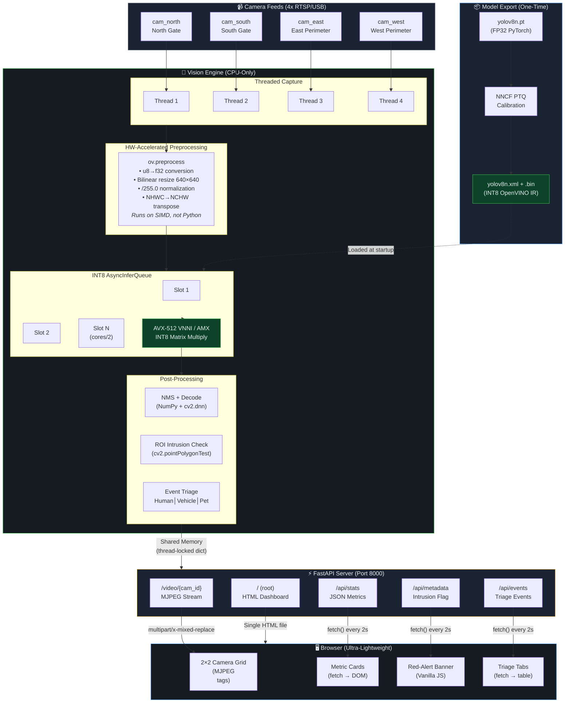

# System Architecture — INT8 Edge Pipeline



## Data Flow Summary

```
Camera (BGR u8) ──► ov.preprocess (SIMD) ──► INT8 Inference (AVX-512/AMX)
                                                      │
                                                      ▼
                                              NMS + ROI Check
                                                      │
                                    ┌─────────────────┼──────────────────┐
                                    ▼                 ▼                  ▼
                              Annotated          JSON Stats        Triage Events
                              Frame (JPEG)       + Alerts          + Intrusions
                                    │                 │                  │
                                    ▼                 ▼                  ▼
                              MJPEG Stream      /api/stats         /api/events
                              (/video/*)        /api/metadata      /api/alerts
                                    │                 │                  │
                                    └─────────┬───────┘──────────────────┘
                                              ▼
                                    Browser (index.html)
                                    •  tags for video
                                    • fetch() for JSON
                                    • Vanilla JS DOM updates
```

## INT8 Performance Advantages

| Metric | FP32 | INT8 | Improvement |
|--------|------|------|-------------|
| Model Size | ~24 MB | ~6 MB | 4× smaller |
| Cache Fit | L3 only | L2 + L1 | Better locality |
| SIMD Width | 16 ops/cycle | 64 ops/cycle (VNNI) | 4× throughput |
| Typical FPS (i7-12th) | 15-20 FPS | 45-60 FPS | 3× faster |
| Power (TDP) | ~35W | ~20W | 40% lower |
